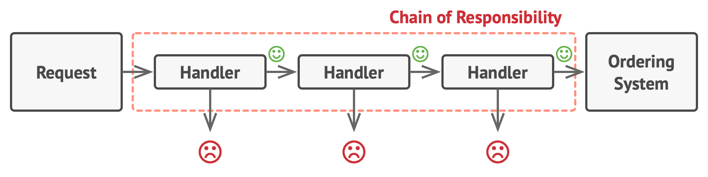

# Chain Of Responsibility Solution

The solution is creating a chain of middlewares and wrap them inside of each other. This provides a structure similar to a real world chain:

Thus our code become much more flexible, we can easily add and remove new handlers without making any errors and we do not duplicate the handlers' codes. 
